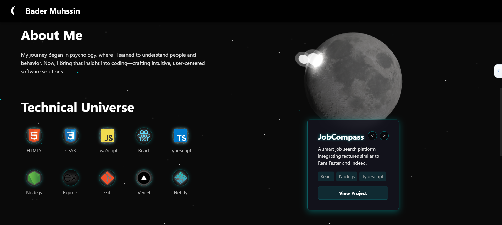

# Bader Muhssin | Space-Themed Portfolio

https://bader-portfolio.netlify.app/



Aportfolio website built with React and Three.js, featuring interactive 3D elements and smooth animations.

## Technologies

- **React** - Component-based UI library
- **Three.js** - 3D rendering engine for the interactive moon
- **CSS Modules** - For component-scoped styling
- **Intersection Observer API** - For triggering animations when elements come into view
- **Custom Animation System** - For space-themed effects and transitions

## Installation & Setup

1. **Clone the repository**
   ```
   git clone https://github.com/yourusername/bader-portfolio.git
   cd bader-portfolio
   ```

2. **Install dependencies**
   ```
   npm install
   ```

3. **Run the development server**
   ```
   npm run dev
   ```

4. **Build for production**
   ```
   npm run build
   ```

## Responsive Design

The portfolio is fully responsive with optimized layouts for:
- Desktop (1200px+)
- Tablet (768px - 1199px)
- Mobile (< 768px)

## Performance Optimizations

- Lazy loading of non-essential components
- Throttled scroll listeners
- Optimized Three.js rendering settings
- Memoized components to prevent unnecessary re-renders
- Reduced DOM elements for star animations

## Contact

For any inquiries, please reach out at: muhssinbader@gmail.com
